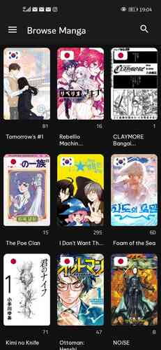
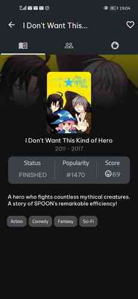

# Tanuki Manga App

 

## ⚠️ Project Status: Under Active Development

**WARNING: This app is a work in progress and has limited functionality.**

## Overview
Tanuki is an experimental Android application for browsing manga using the AniList GraphQL API. Currently in early stages of development.

## Current Features
- Basic manga browsing
- Manga details view
- Character information page
- Recommendation suggestions

## Planned Features
- Advanced search functionality
- User authentication
- Reading list/favorites
- More detailed manga information

## Technologies Used
- Kotlin
- Android Jetpack
- Coroutines
- Paging 3
- Moshi
- OkHttp
- AniList GraphQL API

## Limitations
- Limited manga browsing capabilities
- Minimal user interaction
- Basic UI/UX
- Potential bugs and incomplete features

## Setup
1. Clone the repository
2. Open in Android Studio
3. Sync Gradle dependencies
4. Build and run the app

## Contributions
Contributions and feedback are welcome! Please understand the project is in early stages.

## License
[MIT License](./LICENSE)

## Disclaimer
This is an experimental project and should not be considered a production-ready application.
